# Shogi Commentary Generator (将棋解説文生成システム)

将棋の局面を解析し、解説文を自動生成する **LLMによる将棋AIの指し手解釈** の研究デモです。
本リポジトリは公開版として、機密情報や配布不可資産（有料棋譜データ、各種モデル重み、APIキー等）を含めず、再現手順とサンプル表示を中心に提供します。

## 機能
- **局面特徴の抽出**: 評価値、駒得、玉安全度、囲い、戦法、駒の働きなど
- **シミュレーション**: 複数の変化手順を探索し、末端局面の評価を取得
- **RAG (Retrieval-Augmented Generation)**: 類似局面の参考例をプロンプトに含める
- **解説文生成**: OpenAI GPTを使用して自然な日本語の解説文を生成

## 再現に必要なもの
- Python 3.11+
- OpenAI API キー
- 将棋エンジン（YaneuraOu）
- Maia2 ONNXモデル
- 棋譜コメント（順位戦の棋譜コメント、順位戦・名人戦のコメント付き棋譜など）

## セットアップ
### 1. 依存関係のインストール
```bash
python -m venv .venv
.venv\Scripts\Activate.ps1  # Windows
# または
source .venv/bin/activate   # Linux/Mac
pip install -r requirements.txt
```
### 2. 環境変数の設定
`.env`ファイルを作成:
```
OPENAI_API_KEY=sk-...
OPENAI_MODEL=gpt-4.1-2025-04-14
OPENAI_EMBEDDING_MODEL=text-embedding-3-small
```
### 3. エンジン・モデル・データの配置
以下のファイルは指定のパスに配置してください。
#### やねうら王エンジン
| ファイル | 配置先パス | 用途 |
|---------|-----------|------|
| `YaneuraOu_NNUE_*.exe` | `engine/yaneuraou/` | やねうら王本体 |
| `nn.bin` または評価関数 | `engine/yaneuraou/eval/` | 評価関数 |
**パス変更方法**: `src/simulation/engine_wrapper.py` の `DEFAULT_ENGINE_PATH` を編集
```python
# src/simulation/engine_wrapper.py (L20-24)
DEFAULT_ENGINE_PATH = os.path.join(
    os.path.dirname(__file__),
    "..", "..", "engine", "yaneuraou",
    "YaneuraOu_NNUE_halfkp_256x2_32_32-V900Git_ZEN2.exe"  # ← ここを変更
)
```
または実行時に`EngineConfig`で指定:
```python
from src.simulation.engine_wrapper import EngineConfig, YaneuraouWrapper
config = EngineConfig(path="path/to/your/engine.exe")
wrapper = YaneuraouWrapper(config)
```
---
#### Maia2 ONNXモデル
| ファイル | 配置先パス | 用途 |
|---------|-----------|------|
| `model.onnx` | `models/` | Maia2モデル（人間らしい手を予測） |
**パス変更方法**: `src/simulation/maia2_wrapper.py` の `DEFAULT_MODEL_PATH` を編集
```python
# src/simulation/maia2_wrapper.py (L28-31)
DEFAULT_MODEL_PATH = os.path.join(
    os.path.dirname(__file__),
    "..", "..", "models", "model.onnx"  # ← ここを変更
)
```
または実行時に`Maia2Config`で指定:
```python
from src.simulation.maia2_wrapper import Maia2Config, Maia2Wrapper
config = Maia2Config(model_path="path/to/your/model.onnx")
wrapper = Maia2Wrapper(config)
```
---
#### DLShogi 駒働き評価モデル
| ファイル | 配置先パス | 用途 |
|---------|-----------|------|
| `model-dr2_exhi.onnx` | `models/` | 駒の働き評価用 |
**パス変更方法**: `src/features/extractor.py` の `DEFAULT_MODEL_PATH` を編集
```python
# src/features/extractor.py (L42)
DEFAULT_MODEL_PATH = "models/model-dr2_exhi.onnx"  # ← ここを変更
```
---
#### 訓練データ・RAGインデックス
| ファイル | 配置先パス | 用途 |
|---------|-----------|------|
| `training_data_filtered.jsonl` | `data/training/` | スタイル例・RAG用 |
| `idx_full.npz` | `data/rag/` | RAG埋め込みベクトル |
| `idx_full.meta.jsonl` | `data/rag/` | RAGメタデータ |
---
## 使用方法
### 単一局面の解説生成
```bash
python -m src.training.generate_commentary_openai --sfen "lnsgkgsnl/1r5b1/ppppppppp/9/9/9/PPPPPPPPP/1B5R1/LNSGKGSNL b - 1"
```
### オプション一覧
| オプション | デフォルト値 | 説明 |
|-----------|-------------|------|
| `--sfen` | (必須) | 解説する局面のSFEN |
| `--min-chars` | 500 | 解説文の最小文字数目安 |
| `--max-chars` | 1000 | 解説文の最大文字数目安 |
| `--no-rag` | False | RAGを無効にする |
| `--no-simulation` | False | シミュレーションを無効にする |
| `--rag-index` | `data/rag/idx_full` | RAGインデックスのベースパス |
| `--rag-top-k` | 3 | RAGで取得する参考例の数 |
| `--style-examples-count` | 100 | スタイル例として読み込む解説文の数 |
| `--style-examples-jsonl` | `data/training/training_data_filtered.jsonl` | スタイル例のJSONL |
### シミュレーションなしで実行（エンジン不要）
```bash
python -m src.training.generate_commentary_openai --sfen "..." --no-simulation
```
## テスト
```bash
# エンジン不要のテスト
python -m pytest tests/ --ignore=tests/test_simulation.py --ignore=tests/test_game_simulator.py --ignore=tests/test_maia2_v021.py --ignore=tests/test_wrapper_raw.py
```
## ディレクトリ構成
```
shogiLLM/
├── src/
│   ├── features/       # 局面特徴抽出
│   ├── simulation/     # エンジン連携・シミュレーション
│   ├── training/       # 訓練データ生成・解説文生成
│   └── utils/          # ユーティリティ
├── tests/              # テストコード
├── engine/             # やねうら王
├── models/             # ONNXモデル
├── data/
│   ├── training/       # 訓練データ
│   └── rag/            # RAGインデックス
└── requirements.txt
```
## ライセンス
MIT License

---

## 生成された解説文のサンプル

### 相振り飛車
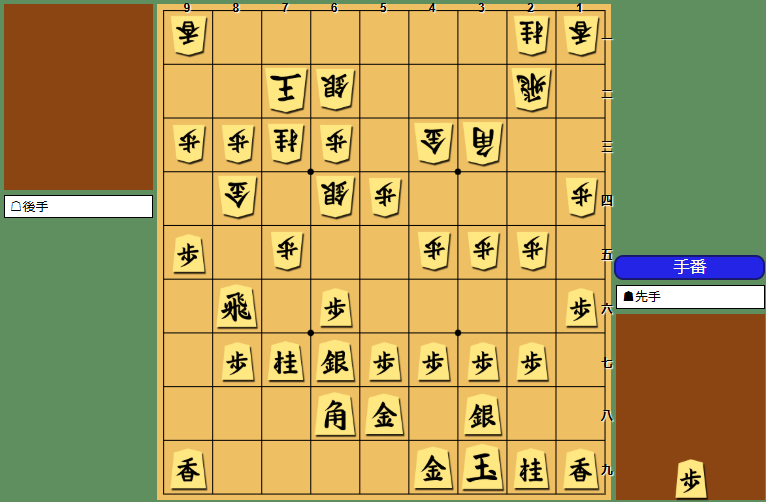

手番は先手。駒得はなく、美濃囲いで自玉は比較的まとまっていますが、後手は駒の働きが勝り、８三歩～８四金を軸に中央から右辺まで厚い形で、形勢は後手が少し指しやすい局面です。先手は８六飛や７七桂が前に出ていますが、攻めの糸口が細く、無理に踏み込むと反撃を呼び込みやすい配置です。例えば端の香を動かして▲９八香とすると、△４四角で角を活用され、▲５六銀に△７六歩▲同飛△７五銀と飛車をいじめられます。先手は▲９六飛とかわしても、△３三桂から▲６五桂△同桂で桂損になりやすく、攻めが空転しがちです。中央の歩突きも、△４四角の受けが利いて簡単には主導権を握れません。方針としては、まず▲９八香で端を補強しつつ次の受けの幅を広げるのが推奨で、急戦に寄せず相手の角の働きを見ながら戦うのが大切です。

### 相振り飛車-2
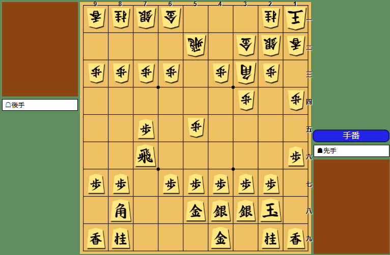

先手番。駒得はなく形勢は先手がわずかに指しやすい局面です。先手は美濃で玉形は比較的安定していますが、後手は居飛車穴熊で受けの土台が堅く、飛角の働きも強い。早石田らしく先手は７筋の飛車を軸に、角桂を活用して穴熊の急所に手を作りたいところです。例えば先に▲４六歩から動くと、△５四飛～△８四飛と飛車を転換され、後手が受けと反撃の形を整えやすく、先手の攻めが空回りしがちです。端や銀の整備に手を回す順もありますが、その間に後手が飛車を動かして主導権を握りやすいでしょう。そこでまずは▲６六角が急所で、△５四飛には▲７七桂と跳ねて攻めの厚みを作り、△５一金に▲４六歩と腰を据える進行が推奨です。最後は▲８六歩～▲８五歩で８筋から圧力をかけ、穴熊攻略の形を作っていきます。

### 相振り飛車-3
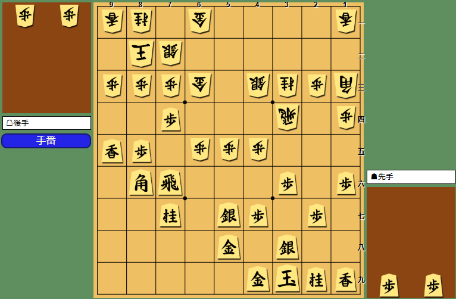

手番は後手。駒得は先手の歩損でわずかに後手が得していますが、先手は美濃がよくまとまり、角が８六から急所をにらんで駒の働きでも上回っています。後手玉は高美濃でも８二で戦場に近く、ここは形勢はほぼ互角ながら、先手のほうが指しやすい局面です。後手が△７四歩と突くのは自然な一手で、▲７四同歩を許さず７筋の争点を整理する狙いです。ただ▲４二角成と切って馬を作られると、後手は△５二金で受ける形になりやすい。例えば△７四歩▲４二角成△５二金▲４一馬と進めば先手は馬の効きで後手陣に圧力がかかり、後手が△６四飛から８筋を受けても、▲８四歩△同歩▲８五歩打などで先手が攻めの形を作れてしまいます。したがって後手としては、まず△７四歩で７筋を押さえ、▲４二角成には△５二金で馬の侵入を最小限にとどめる順が推奨です。

### 相穴熊
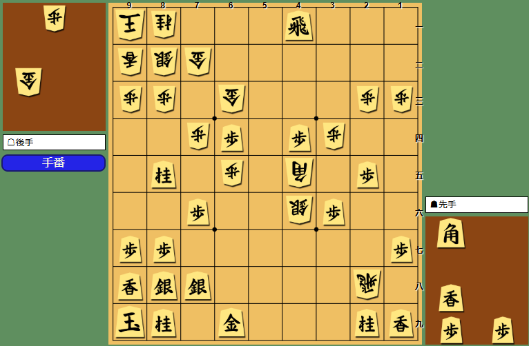

後手番。居飛車穴熊対振り飛車穴熊で玉の堅さは互角ですが、先手が金と桂香の交換で駒得しており、形勢は先手が有利です。先手の４一飛と６四歩が強く、後手は２八飛と４五角が働くものの、決定打になりにくい局面です。後手が強引に△７八角成▲同金△同飛成と踏み込む手はありますが、竜を作れても先手の受けが間に合いやすく、攻めが細くなりがちです。△６二金から手を作る場合も、▲６三香打が厳しく、△７八角成▲同金△同飛成と進んでも、先手は▲７九金打と要所を締めて後続を切らし、押し切られにくい形になります。本線としては△６二金に▲６三香打を許さない工夫が欲しいものの、結論としては△６二金に対し▲６三香打～▲６三歩成を狙う順が先手の推奨になります。

### 後手勝ちの終盤
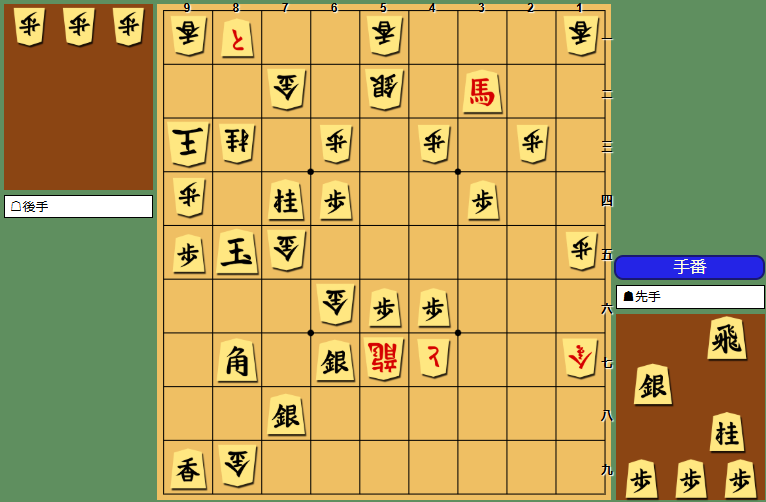

先手番ですが形勢は後手が勝勢です。駒得自体は先手が金二枚と香を得た計算でも、先手玉が８五と前に出ていて金銀の壁も薄く、後手の竜５七、と金４七、金７五・６六が一直線に迫る形で玉の安全度に大差があります。後手玉は９三で香も利いており、寄り付きにくい配置です。例えば▲９六玉と逃げても△９五歩で追われ、▲９七玉に△６七金と踏み込まれると一気に受けが難しくなります。ここで▲９四歩打△同玉▲９三飛打△同玉▲８五桂打のように攻め合いを選んでも、△同金で攻め駒が途切れ、先手は飛銀桂を失って収拾がつきません。穏やかに▲９六玉△９五歩▲９七玉とする順でも、結局は後手の金の侵入が残って苦しいままです。推奨はまず▲９六玉から、少しでも玉を逃がす方向を優先する手順になります。

### 中盤
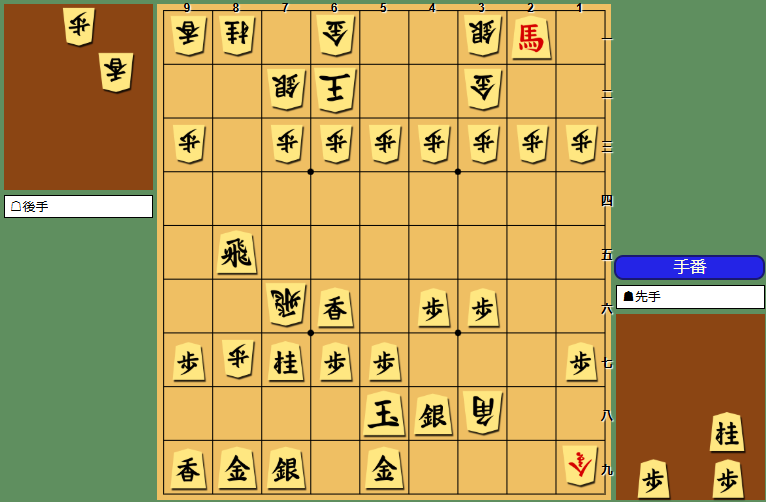

先手番。駒得は歩損ながら、馬が２一に居座って３二金・３一銀をにらみ、８五飛も横利きが強く攻めの主導権は先手にあります。玉は５八でまだ薄い形ですが、後手玉も６二の片美濃で戦場に近く、形勢は先手がはっきり優勢です。ただし派手に▲８二飛成と踏み込むと、△７七飛成で後手も竜を作って迫ってきます。例えば▲８四桂打や▲７八銀、▲５五桂打と続けても、桂損が響きやすく、攻め合いの難しい将棋になりがちです。落ち着いては▲６八銀が好手。△８八歩成▲同金△１八成桂と暴れられても、▲５五桂打から▲６五飛を用意して飛角交換に持ち込み、最後は△６四歩と受けられても先手が攻め切りやすい流れです。推奨はまず▲６八銀で自玉を固めつつ決めにいく指し方でしょう。

### 中盤-2
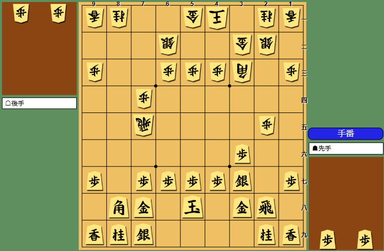

先手番で形勢はほぼ互角です。駒得はなく、先手は右玉調の中住まいで手は作りやすいものの、玉の堅さでは中原囲いの後手が上回ります。盤上は後手の７五飛と３三角がよく働いており、先手は２八飛を軸に反撃の糸口を探す局面でしょう。たとえば無理に▲８二歩打から踏み込むと、△８五飛▲８一歩成△８六歩打▲９一と△８七歩成▲同金△同飛成で後手に竜を作られ、先手玉が薄いぶん一気に苦しくなります。▲７六歩も△同飛で飛車をさばかれて、▲３三角成としても後手の反撃が残りやすい展開です。ここは▲８六歩打が自然で、△３五歩打▲同歩△同飛▲７六歩△３四飛と飛車を追い、▲３三角成△同桂▲５六角打から主導権を握るのが推奨です。

### 終盤
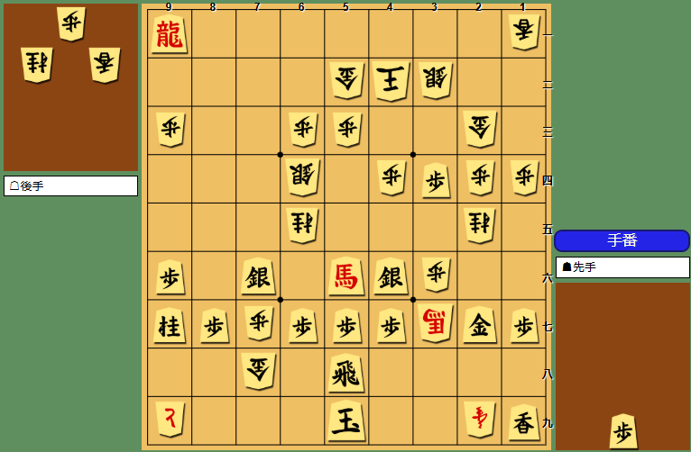

先手番ですが形勢は後手が有利です。駒得は先手が飛車と引き換えに金桂香を得ているものの、先手玉は５九で薄く、後手玉は４二で金２枚が近く安全度に大きな差があります。戦法は中飛車系の名残で先手の９一竜と５六馬は働いていますが、後手は３七の馬と２九の成香、と金が厚く、先手玉への圧力が強い局面です。例えば▲３七銀と踏み込むと、△同歩成でと金を作られ、▲３一角打△４三玉とかわされます。続いて▲６五銀に△４五銀打から△５六銀と馬を狙われ、▲５三角成△同金となると、攻めが細り駒損も拡大して苦しくなります。実戦的には推奨手順の▲３七銀から▲３一角打で後手玉に迫りつつ、▲６五銀で局面をこじ開けにいく勝負になります。

### 終盤-2
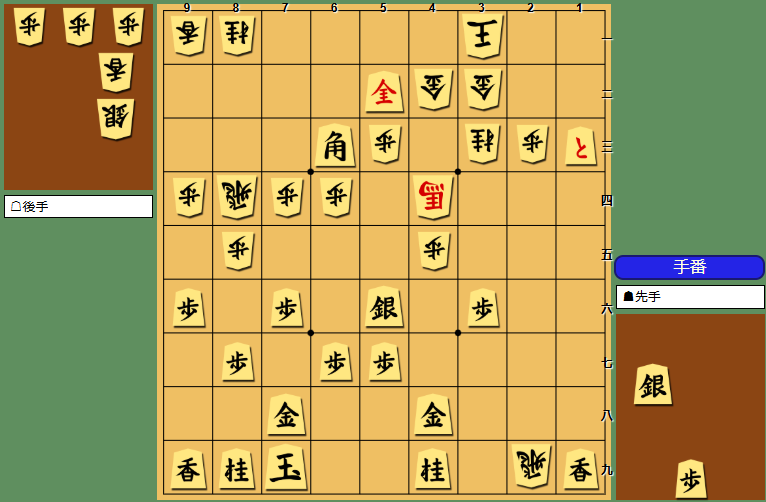

先手番で、形勢は先手が大きく勝勢です。飛と銀の交換で駒得しているうえ、５二の成銀と６三角、さらに１三のとが後手玉（３一）に迫っており、後手の馬や飛車が働いていても受けが追いつきにくい局面です。先手玉は７九で金が近く、後手からの即詰み筋も見えません。例えば強引に▲４二成銀△同玉と踏み込む手もありますが、続く▲５五銀打には△５二銀打の受けが利いて、後手玉の危険度が一度下がります。別の▲４二成銀△同玉▲３五銀打も、△８八銀打の切り返しが生じて先手玉に嫌味が残り、勝勢を自ら難しくしかねません。本筋は▲５一銀打から、△２五桂に▲４二銀△同金▲２二金打△同馬▲同と△同玉▲１一角打△２一玉と迫る順で、後手玉を薄くして寄せ切る狙いが明快です。

### 対抗形
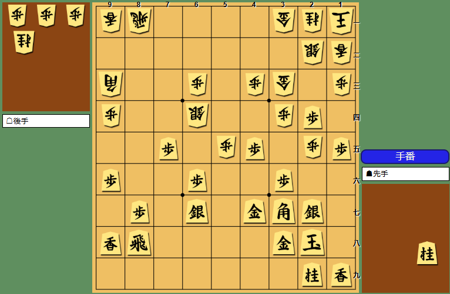

手番は先手で、形勢はほぼ互角ながら先手が少し指しやすい局面です。ただし先手は歩損しており、後手は居飛車穴熊で玉の密度が高く、正面からの攻め合いでは簡単に崩れません。一方で先手玉は２八に収まり金銀も近く、極端に危ないわけではないものの、後手の駒の働きが全体に勝っている点は意識したいところです。例えば強引に▲１六桂打と踏み込むと、△３二桂打で受けと反撃の形を作られ、▲９五歩に△７五角と角が出て先手の７五歩が目標になります。さらに▲４六角と受けても△２六歩▲同銀△７六歩打から歩を絡めて迫られ、▲３七桂△７七歩成となれば後手がと金を作って戦いやすくなります。一方、局面をはっきりさせるなら▲２三桂打が狙い目です。△同銀▲同歩成△同金と進めば駒交換にはなりますが、後手玉の周辺に手がつき、穴熊の堅さを少し削れる分だけ先手がまとめやすいでしょう。推奨はこの▲２三桂打からの清算です。

### 対抗形-2
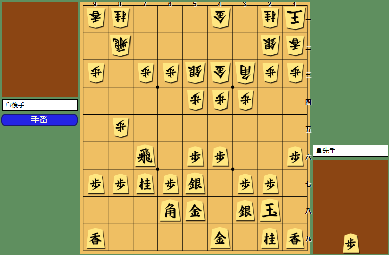

手番は後手。形勢は先手がわずかに良い程度で、駒得はなく、先手は美濃囲い、後手は居飛車穴熊という構図です。玉の堅さはほぼ同等ですが、後手は飛・角の働きがよく、８筋からの歩交換や２四角の筋で一気に戦いを起こせる含みがあります。一方で先手は７六飛と７七桂が活きており、端の１五歩から角筋をずらしつつ攻めの足場を作りたい局面です。例えば△３一金と整えてから▲１五歩に△６四銀▲６六銀△４二角と進むと、後手は穴熊の形を崩さず中央の受けを厚くしますが、先手も銀が前に出て角の活用が利き、互角以上に戦えます。逆に後手が△８六歩から強引に動く順は、▲同歩△同飛▲８五飛△同飛▲同桂のように先手に桂を活用され、攻めが空転しやすいのが注意点でしょう。後手としては、まず△６四銀で中央を締め、▲１五歩に△４二角と引いて受けの骨格を整える手順が推奨になります。

