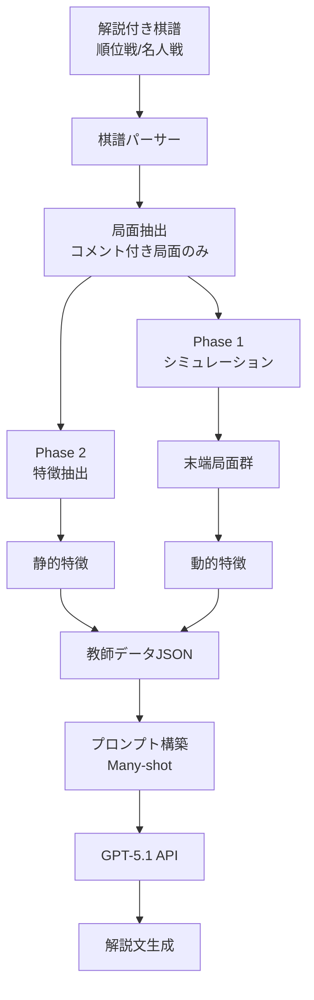

# Phase 3: 解説文生成LLM 実装計画

## 概要

Phase 1（シミュレーション）とPhase 2（特徴抽出）の成果を活用し、将棋AIの指し手を自然言語で解説するLLMシステムを構築する。

---

## 目標

1. **教師データ生成**: プロ公式戦の解説付き棋譜から「局面特徴+コメント」ペアを生成
2. **プロンプト構築**: Many-shot方式で高品質な解説を生成
3. **LLM API連携**: GPT-5.1 APIを呼び出し解説文を取得

---

## システム構成図



---

## 1. 教師データ生成

### 1.1 データソース

プロ公式戦のコメント付き棋譜を使用する。

| ソース | 例 | 備考 |
|--------|------|------|
| 順位戦中継 | A級順位戦 | リアルタイム解説付き |
| 名人戦中継 | 名人戦7番勝負 | 詳細な解説付き |
| 竜王戦/王位戦 | 主要タイトル戦 | 高品質な解説 |

### 1.2 入力データ形式

```
1 ７六歩(77)
2 ８四歩(83)
3 ６六角(88)
...
15 １六歩(17)
９分考え、端の突き合いに応じた。どの囲いを選ぶかを含め、今後の方針を定める段階に入ってきたか。
16 ４四歩(43)
５分の考慮で△４四歩と突き、角交換を拒否した。先手は角が負担にならない駒組みが求められる。
```

### 1.3 データ構造

```json
{
  "sfen": "ln1g3nl/1ks1gr3/...",
  "features": {
    "static": {
      "material": {...},
      "king_safety": [...],
      "castles": [...],
      "strategies": [...]
    },
    "dynamic": {
      "score_change": 150,
      "material_change": 0,
      "terminal_sfens": ["...", "...", "..."]
    }
  },
  "commentary": "５分の考慮で△４四歩と突き、角交換を拒否した。先手は角が負担にならない駒組みが求められる。"
}
```

### 1.4 動的特徴の生成

1. コメント付き局面のSFENを抽出
2. Phase 1シミュレーションを実行し、**末端局面群**を取得
3. 各末端局面に対してPhase 2で動的特徴を計算
4. 実際の解説文と対応付け

---

## 2. プロンプト構築

### 2.1 Many-shot方式

```
【システムプロンプト】
あなたはプロ棋戦の解説者です。
局面特徴と人間が作ったその局面の解説文の組み合わせの大量の例を参考に、
次の局面およびその局面特徴に対し、解説文を生成してください。

【例1】
局面(SFEN): lnsgkgsnl/...
局面特徴:
- 戦法: 四間飛車
- 囲い: 美濃囲い
- 駒得: なし
- 評価値変化: +150
- 末端局面での形勢差: 先手有利

解説: 先手は四間飛車から美濃囲いに組み上げました。...

【例2】
...

【今回の局面】
局面(SFEN): {sfen}
局面特徴:
{features}

解説:
```

### 2.2 プロンプトテンプレート

```
src/llm/
├── prompts/
│   ├── system.txt       # システムプロンプト
│   ├── examples.json    # Many-shot例（教師データから抽出）
│   └── template.py      # テンプレート管理
```

---

## 3. LLM API連携

### 3.1 サポートAPI

| API | モデル | 備考 |
|-----|--------|------|
| OpenAI | gpt-5.1 | メイン |

### 3.2 実装構造

```
src/llm/
├── __init__.py
├── client.py           # OpenAI API呼び出し
├── generator.py        # 解説生成メイン
└── config.py           # API設定
```

### 3.3 設定ファイル

```yaml
# config/llm.yaml
openai:
  model: gpt-5.1
  temperature: 0.7
  max_tokens: 500
```

---

## 4. 実装順序

| 順序 | タスク | 依存 |
|------|--------|------|
| 1 | 棋譜パーサー実装（コメント抽出） | なし |
| 2 | 教師データ生成スクリプト | Phase 1, Phase 2 |
| 3 | プロンプトテンプレート設計 | なし |
| 4 | OpenAI APIクライアント実装 | なし |
| 5 | 解説生成器統合 | 1-4 |
| 6 | テスト・評価 | 5 |

---

## 5. ファイル構成

```
src/llm/
├── __init__.py
├── client.py           # OpenAI API実装
├── generator.py        # 解説生成メイン
├── config.py           # 設定管理
├── data_generator.py   # 教師データ生成（棋譜→JSON）
├── kifu_parser.py      # 棋譜パーサー（コメント抽出）
└── prompts/
    ├── system.txt
    ├── examples.json
    └── template.py

tests/
├── test_llm_client.py
├── test_generator.py
└── test_kifu_parser.py

data/training/
├── training_data.json  # 教師データ（局面+特徴+コメント）
└── examples.json       # Many-shot例

config/
└── llm.yaml            # LLM設定
```

---

## 6. 検証計画

### 6.1 自動テスト

- 棋譜パーサーの正確性
- コメント抽出の精度
- API呼び出しのエラーハンドリング

### 6.2 手動評価

- 生成された解説の品質評価（人間による）
- 5局面×3パターンで評価

### 6.3 YouTube解説動画との比較

- YouTubeに公開されている対局解説動画を文字起こし
- 同一局面に対する生成解説と比較
- 情報量・表現の自然さ・正確性を評価

---

## 7. 考慮事項

### セキュリティ
- APIキーは環境変数で管理（`.env`）
- キーをコードやGitにコミットしない

### コスト
- 開発中はトークン数を制限
- 本番運用時のコスト見積もりを行う

### エラーハンドリング
- API制限時のリトライ
- タイムアウト処理
