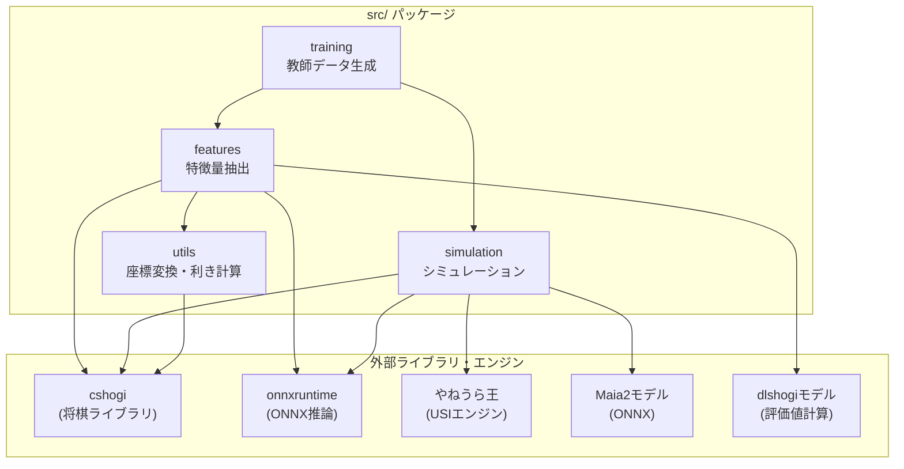

# shogiLLM プロジェクト構成

LLMによる将棋AIの指し手解説生成システムの技術構成と、各パッケージの役割を説明します。

---

## プロジェクト概要

将棋AIの指し手を人間が理解しやすい形で解説するシステム。

- **強AI（やねうら王）** と **人間レベルAI（Maia2）** を組み合わせ
- 形勢がはっきりするまでシミュレーションを実行
- 局面特徴を抽出し、LLMで自然言語の解説文を生成

---

## パッケージ依存関係



---

## ディレクトリ構成

```
shogiLLM/
├── src/
│   ├── features/       # 局面特徴抽出パッケージ
│   ├── simulation/     # シミュレーションパッケージ
│   ├── training/       # 教師データ生成スクリプト
│   └── utils/          # 共通ユーティリティ
├── tests/              # テストコード
├── docs/               # ドキュメント
├── data/               # データファイル
├── models/             # AIモデルファイル
└── engine/             # 将棋エンジン
```

---

## パッケージ一覧

### [features](file:///c:/Users/hashimoto/shogiLLM/src/features) - 局面特徴抽出

局面から静的・動的特徴を抽出し、LLM入力用テキストを生成。

| モジュール | 説明 |
|-----------|------|
| `extractor.py` | 統合API（`FeatureExtractor`クラス） |
| `models.py` | データクラス定義 |
| `static_low.py` | 低レベル静的特徴（81マス、持ち駒） |
| `static_high.py` | 高レベル静的特徴（囲い、戦法、玉安全度） |
| `dynamic.py` | 動的特徴（2局面の比較） |
| `material.py` | 駒得計算 |
| `dlshogi_wrapper.py` | dlshogiモデルラッパー |
| `patterns/` | 囲い・戦法パターン定義 |

📖 詳細: [features_package.md](file:///c:/Users/hashimoto/shogiLLM/docs/features/features_package.md)

---

### [simulation](file:///c:/Users/hashimoto/shogiLLM/src/simulation) - シミュレーション

やねうら王とMaia2を使用した局面分析・シミュレーション。

| モジュール | 説明 |
|-----------|------|
| `engine_wrapper.py` | やねうら王USIラッパー |
| `maia2_wrapper.py` | Maia2 ONNXラッパー |
| `simulator.py` | 基本シミュレーター（評価値＋人間らしい手） |
| `game_simulator.py` | 形勢明確化シミュレーター（ツリー構築） |
| `models.py` | データクラス定義 |

📖 詳細: [simulation_package.md](file:///c:/Users/hashimoto/shogiLLM/docs/game_simulator/simulation_package.md)

---

### [training](file:///c:/Users/hashimoto/shogiLLM/src/training) - 教師データ生成

LLM学習用の教師データ生成スクリプト群。

| スクリプト | 説明 |
|-----------|------|
| `generate_training_data.py` | 局面特徴＋コメント → 教師データ |
| `generate_commentary_openai.py` | OpenAI APIで解説文生成 |
| `convert_kif_to_json.py` | KIF → JSON変換 |
| `cleanse_kif_commentary.py` | コメントクレンジング |
| `output_simulation_tree.py` | シミュレーション結果出力 |

📖 詳細: [training_package.md](file:///c:/Users/hashimoto/shogiLLM/docs/training/training_package.md)

---

### [utils](file:///c:/Users/hashimoto/shogiLLM/src/utils) - 共通ユーティリティ

座標変換、利き計算など汎用関数群。

| モジュール | 説明 |
|-----------|------|
| `coordinates.py` | 座標変換（USI ↔ 日本語表記） |
| `attacks.py` | 駒の利き計算 |
| `KIF_to_usi.py` | KIF形式 → USI形式変換 |
| `dlshogi.py` | dlshogi特徴量 → SFEN変換 |

📖 詳細: [utils_package.md](file:///c:/Users/hashimoto/shogiLLM/docs/utils/utils_package.md)

---

## 技術スタック

| カテゴリ | 技術 |
|---------|------|
| 言語 | Python 3.13 |
| 将棋ライブラリ | cshogi |
| 将棋エンジン | やねうら王 + 水匠5 |
| 人間レベルAI | Maia2 (ONNX) |
| 評価値計算 | dlshogi (ONNX) |
| 推論 | onnxruntime-gpu |
