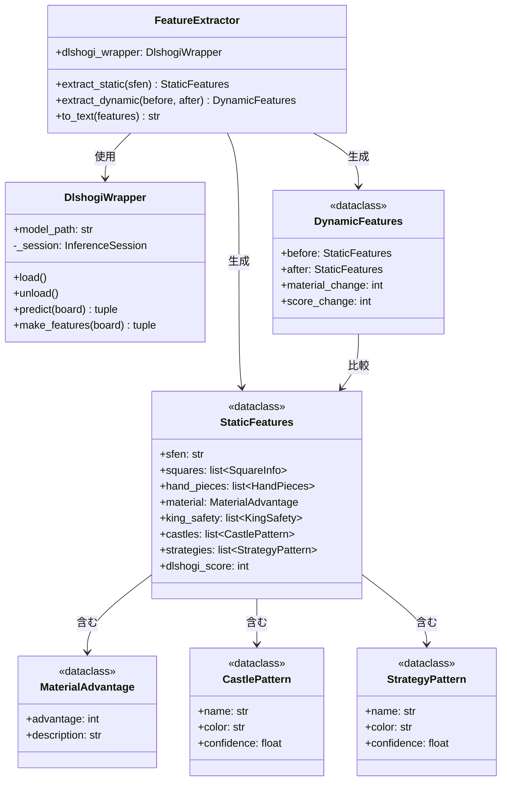

# features パッケージ クラス構成

`src/features` パッケージは、将棋局面から静的・動的特徴を抽出し、LLM入力用テキストを生成する機能を提供します。

---

## クラス関係図



---

## ファイル構成

```
src/features/
├── __init__.py          # パッケージ定義（公開APIをエクスポート）
├── extractor.py         # 統合API（FeatureExtractor）
├── models.py            # データクラス定義
├── dlshogi_wrapper.py   # dlshogiモデルラッパー
├── material.py          # 駒得計算
├── static_low.py        # 低レベル静的特徴（81マス、持ち駒）
├── static_high.py       # 高レベル静的特徴（囲い、戦法、玉安全度）
├── dynamic.py           # 動的特徴（2局面比較）
└── patterns/            # パターン定義
    ├── __init__.py
    ├── castles.py       # 囲いパターン定義
    └── strategies.py    # 戦法パターン定義
```

---

## クラス詳細

### FeatureExtractor（統合API）

**ファイル**: [extractor.py](file:///c:/Users/hashimoto/shogiLLM/src/features/extractor.py)

全ての特徴抽出機能を統合した高レベルAPI。

```python
extractor = FeatureExtractor()
features = extractor.extract_static(sfen)
text = extractor.to_text(features)
print(text)  # LLM入力用テキスト
```

| メソッド | 説明 |
|----------|------|
| `extract_static(sfen)` | 静的特徴を抽出し `StaticFeatures` を返す |
| `extract_dynamic(before, after)` | 2局面を比較し `DynamicFeatures` を返す |
| `to_text(features)` | 特徴をLLM入力用テキストに変換 |

---

### DlshogiWrapper（dlshogiモデルラッパー）

**ファイル**: [dlshogi_wrapper.py](file:///c:/Users/hashimoto/shogiLLM/src/features/dlshogi_wrapper.py)

dlshogiのONNXモデルを使用して評価値を計算する。

| メソッド | 説明 |
|----------|------|
| `load()` | モデルをロード |
| `unload()` | モデルをアンロード |
| `predict(board)` | 局面の評価値を計算 |
| `make_features(board)` | dlshogi形式の特徴量を生成 |

---

## 静的特徴抽出

### 低レベル特徴（static_low.py）

**ファイル**: [static_low.py](file:///c:/Users/hashimoto/shogiLLM/src/features/static_low.py)

| 関数 | 説明 |
|------|------|
| `extract_all_squares(board)` | 81マスの情報を抽出 |
| `extract_hand_pieces(board)` | 持ち駒を抽出 |
| `get_adjacent_squares(square)` | 隣接マスを取得 |

### 高レベル特徴（static_high.py）

**ファイル**: [static_high.py](file:///c:/Users/hashimoto/shogiLLM/src/features/static_high.py)

| 関数 | 説明 |
|------|------|
| `recognize_castles(board)` | 囲いを認識（例: 美濃、穴熊） |
| `recognize_strategies(board)` | 戦法を認識（例: 四間飛車、居飛車） |
| `calculate_king_safety(board)` | 玉の安全度を計算 |

---

## データクラス

**ファイル**: [models.py](file:///c:/Users/hashimoto/shogiLLM/src/features/models.py)

### StaticFeatures（静的特徴）

| 属性 | 型 | 説明 |
|------|-----|------|
| `sfen` | `str` | 局面のSFEN文字列 |
| `squares` | `list[SquareInfo]` | 81マスの情報 |
| `hand_pieces` | `list[HandPieces]` | 持ち駒（先手・後手） |
| `material` | `MaterialAdvantage` | 駒得情報 |
| `king_safety` | `list[KingSafety]` | 玉の安全度 |
| `castles` | `list[CastlePattern]` | 認識された囲い |
| `strategies` | `list[StrategyPattern]` | 認識された戦法 |
| `dlshogi_score` | `int` | dlshogi評価値 |

### DynamicFeatures（動的特徴）

| 属性 | 型 | 説明 |
|------|-----|------|
| `before` | `StaticFeatures` | 変化前の局面 |
| `after` | `StaticFeatures` | 変化後の局面 |
| `material_change` | `int` | 駒得の変化 |
| `score_change` | `int` | 評価値の変化 |
| `promotions` | `list[str]` | 成駒発生リスト |

---

## パターン定義

### 囲いパターン（patterns/castles.py）

**ファイル**: [castles.py](file:///c:/Users/hashimoto/shogiLLM/src/features/patterns/castles.py)

美濃囲い、穴熊、矢倉、銀冠など40種類以上の囲いを定義。

### 戦法パターン（patterns/strategies.py）

**ファイル**: [strategies.py](file:///c:/Users/hashimoto/shogiLLM/src/features/patterns/strategies.py)

居飛車、四間飛車、三間飛車、中飛車など15種類以上の戦法を定義。
