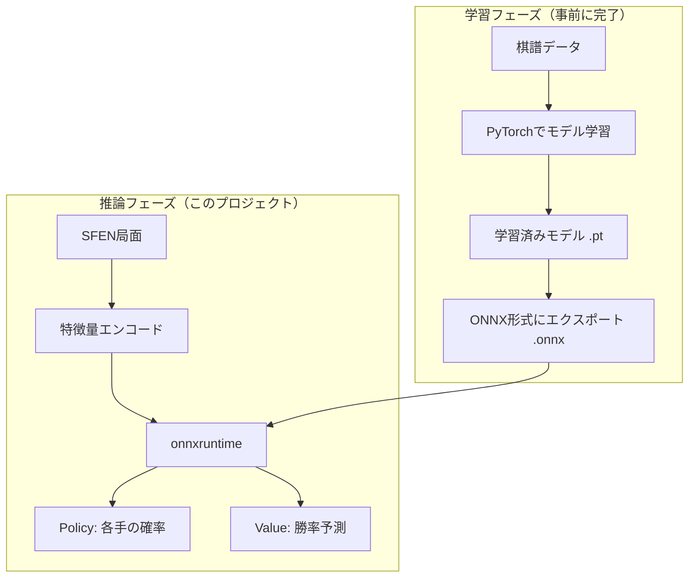
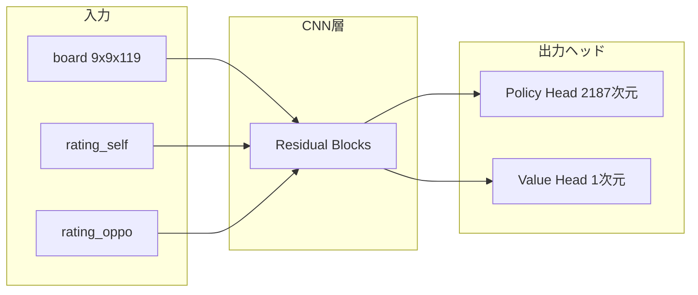
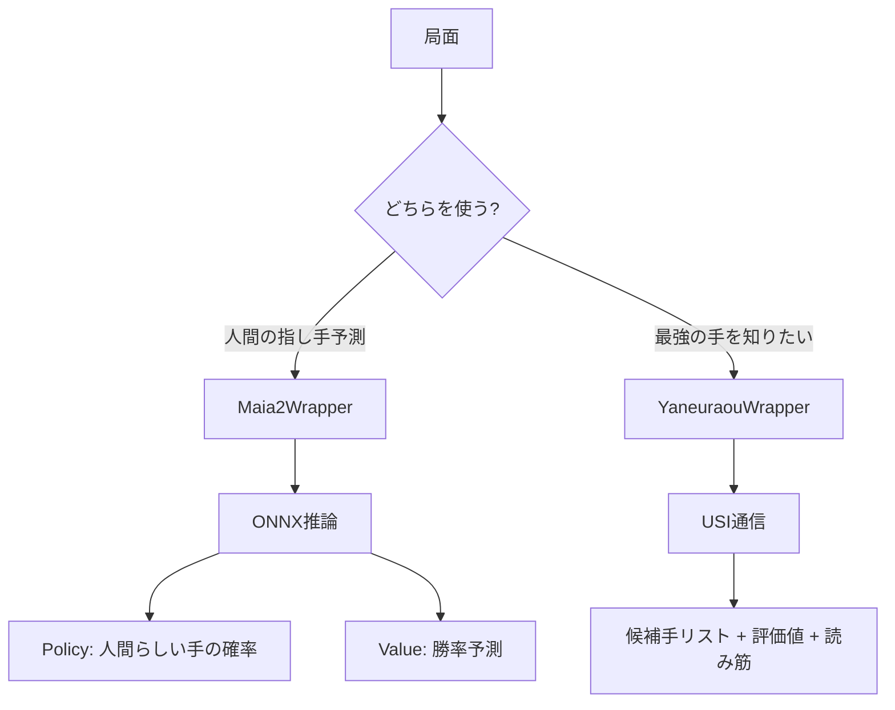

# ONNX と将棋AI の連携アーキテクチャ

このドキュメントでは、ONNX形式の機械学習モデルが将棋AIシステム内でどのように動作するかを解説します。

---

## 1. 全体像



---

## 2. ONNXとは？

### 概要

**ONNX（Open Neural Network Exchange）** は、機械学習モデルの**共通フォーマット**です。

| 特徴 | 説明 |
|------|------|
| **相互運用性** | PyTorch、TensorFlow、JAXなど異なるフレームワーク間でモデルを共有 |
| **軽量実行** | onnxruntimeは本体のフレームワークより軽量（PyTorch: 数GB → onnxruntime: 数十MB） |
| **高速推論** | 推論に特化した最適化が施されている |

### なぜONNXを使うのか？

```
❌ PyTorchを直接使う場合
   └── torch (2GB+) + CUDA (3GB+) = 巨大な依存関係

✅ ONNXを使う場合
   └── onnxruntime (50MB程度) = 軽量、高速
```

---

## 3. Maia-2モデルの構造

### 入力（Inputs）

| 入力名 | 形状 | 説明 |
|--------|------|------|
| `board` | (1, 9, 9, 119) | 盤面の特徴量テンソル |
| `rating_self` | (1,) | 自分のレーティングビン (0-19) |
| `rating_oppo` | (1,) | 相手のレーティングビン (0-19) |
| `legal_moves` | (1, 2187) | 合法手マスク（オプション） |

### 出力（Outputs）

| 出力 | 形状 | 説明 |
|------|------|------|
| `policy` | (1, 2187) | 各手の確率（logits） |
| `value` | (1,) | 勝率予測（logit） |

### ネットワーク構造（概念図）



---

## 4. 盤面エンコーディング

### なぜ 9x9x119 なのか？

将棋盤は9x9マスですが、それだけでは情報が足りません。
「どの駒がどこにあるか」を**チャネル**で表現します。

```
チャネル例（119チャネルの内訳）:
├── 盤上の駒（62チャネル程度）
│   ├── 先手の歩があるマス (9x9)
│   ├── 先手の香があるマス (9x9)
│   ├── ...
│   ├── 後手の歩があるマス (9x9)
│   └── ...
└── 持ち駒・その他情報（57チャネル程度）
    ├── 先手の持ち駒の数
    ├── 後手の持ち駒の数
    └── 手番情報など
```

### エンコード処理（dlshogi形式）

```python
from cshogi.dlshogi import make_input_features, FEATURES1_NUM, FEATURES2_NUM

# 特徴量配列を作成
feature1 = np.zeros((FEATURES1_NUM, 9, 9), dtype=np.float32)  # 盤上の駒
feature2 = np.zeros((FEATURES2_NUM, 9, 9), dtype=np.float32)  # 持ち駒等

# cshogiが自動的に埋めてくれる
make_input_features(board, feature1, feature2)

# 結合して形状変換
features = np.concatenate([feature1, feature2], axis=0)  # (119, 9, 9)
features = np.transpose(features, (1, 2, 0))             # (9, 9, 119) - HWC形式
```

---

## 5. 推論の流れ

### ステップバイステップ

```python
# 1. モデルをロード
session = ort.InferenceSession("model.onnx")

# 2. SFEN局面を設定
board = cshogi.Board()
board.set_sfen("lnsgkgsnl/1r5b1/ppppppppp/9/9/9/PPPPPPPPP/1B5R1/LNSGKGSNL b - 1")

# 3. 盤面を特徴量に変換
features = encode_board_dlshogi(board)  # (9, 9, 119)

# 4. レーティングをビンに変換
rating_self = bin_rating(1500)  # → 7
rating_oppo = bin_rating(1500)  # → 7

# 5. 合法手マスクを作成
legal_mask = get_legal_moves_mask(board)  # (2187,)

# 6. 推論実行
outputs = session.run(None, {
    "board": features[np.newaxis, ...],      # (1, 9, 9, 119)
    "rating_self": np.array([rating_self]),  # (1,)
    "rating_oppo": np.array([rating_oppo]),  # (1,)
    "legal_moves": legal_mask[np.newaxis, ...]  # (1, 2187)
})

# 7. 結果を解釈
policy_logits = outputs[0][0]  # (2187,)
value_logit = outputs[1][0]    # スカラー

# 8. 確率に変換
policy_probs = softmax(policy_logits)
win_rate = sigmoid(value_logit)
```

---

## 6. Policy出力の解釈

### 2187ラベルとは？

将棋の指し手を一意のラベル（0〜2186）にマッピングしています。

```
ラベル = 移動元 × 何か + 移動先 × 何か + 成り情報
```

### ラベルから指し手への変換

```python
from cshogi.dlshogi import make_move_label

# 合法手をループして、ラベルが一致する手を探す
for move in board.legal_moves:
    label = make_move_label(move, board.turn)
    if label == target_label:
        return move
```

### Policy → 確率への変換

```python
# 非合法手をマスキング
masked_logits = policy_logits.copy()
masked_logits[legal_mask < 0.5] = -1e9  # 非合法手は極小値

# Softmaxで確率化
probs = np.exp(masked_logits) / np.sum(np.exp(masked_logits))
```

---

## 7. Value出力の解釈

### Logit → 勝率への変換

```python
value_logit = outputs[1][0]  # 例: 0.5
win_rate = 1.0 / (1.0 + np.exp(-value_logit))  # Sigmoid
# → 0.622 (約62%の勝率)
```

| value_logit | win_rate | 意味 |
|-------------|----------|------|
| 0.0 | 0.50 | 互角 |
| 1.0 | 0.73 | やや有利 |
| 2.0 | 0.88 | 明らかに有利 |
| -1.0 | 0.27 | やや不利 |

---

## 8. やねうら王との違い

| 項目 | Maia-2 (ONNX) | やねうら王 (USI) |
|------|---------------|------------------|
| **目的** | 人間らしい手の予測 | 最強の手を探索 |
| **手法** | ニューラルネット | 探索 + 評価関数 |
| **出力** | 全手の確率分布 | 最善手 + 評価値 |
| **速度** | 1回の推論で完了 | 深く探索するほど強い |
| **特徴** | レーティング別の予測 | 常に最強を目指す |

---

## 9. このプロジェクトでの使い分け



---

## 10. まとめ

1. **ONNX** は機械学習モデルの共通フォーマット
2. **onnxruntime** で軽量・高速に推論を実行
3. **盤面エンコーディング** で将棋盤を数値テンソルに変換
4. **Policy** は各手の確率、**Value** は勝率を予測
5. Maia-2は「人間らしさ」、やねうら王は「最強」を目指す

---

## 11. Maia2Wrapper の使い方

### 基本的な使い方

```python
from src.simulation.maia2_wrapper import Maia2Wrapper, Maia2Config

# 設定を作成
config = Maia2Config(
    model_path="models/model.onnx",  # ONNXモデルのパス
    rating_self=1500,                # 予測対象のレーティング
    rating_oppo=1500,                # 対戦相手のレーティング（省略可）
    top_k=5,                         # 取得する候補手の数
)

# with 文を使う方法（推奨）
with Maia2Wrapper(config) as maia:
    result = maia.predict("lnsgkgsnl/1r5b1/ppppppppp/9/9/9/PPPPPPPPP/1B5R1/LNSGKGSNL b - 1")
    
    print(f"最善手: {result.move}")           # "7g7f"
    print(f"確率: {result.probability:.2%}")  # "61.02%"
    print(f"勝率: {result.value:.2%}")        # "62.42%"
```

### 戻り値 `Maia2Prediction` の構造

```python
@dataclass
class Maia2Prediction:
    move: str                      # 最も確率が高い手（USI形式）
    probability: float             # その手を指す確率（0.0〜1.0）
    value: float                   # 局面の勝率（0.0〜1.0）
    top_moves: list[tuple[str, float]]  # 上位k個の候補手と確率
```

### 候補手リストの取得

```python
with Maia2Wrapper(config) as maia:
    result = maia.predict(sfen)
    
    # 上位5手を表示
    for move, prob in result.top_moves:
        print(f"{move}: {prob:.2%}")
        
# 出力例:
# 7g7f: 61.02%
# 2g2f: 27.38%
# 5g5f: 8.05%
# 7i7h: 0.96%
# 9g9f: 0.75%
```

### 複数局面を連続で推論

```python
sfens = [
    "lnsgkgsnl/1r5b1/ppppppppp/9/9/9/PPPPPPPPP/1B5R1/LNSGKGSNL b - 1",
    "lnsgkgsnl/1r5b1/ppppppppp/9/9/2P6/PP1PPPPPP/1B5R1/LNSGKGSNL w - 2",
    # ... 他の局面
]

with Maia2Wrapper(config) as maia:
    for sfen in sfens:
        result = maia.predict(sfen)
        print(f"局面: {sfen[:30]}... → 最善手: {result.move}")
```

### with 文を使わない方法

```python
maia = Maia2Wrapper(config)
maia.load()  # モデルをロード

try:
    result = maia.predict(sfen)
    print(result.move)
finally:
    maia.unload()  # リソースを解放
```

### レーティング別の予測比較

```python
sfen = "lnsgkgsnl/1r5b1/ppppppppp/9/9/9/PPPPPPPPP/1B5R1/LNSGKGSNL b - 1"

for rating in [1000, 1500, 2000, 2500]:
    config = Maia2Config(rating_self=rating)
    with Maia2Wrapper(config) as maia:
        result = maia.predict(sfen)
        print(f"Rating {rating}: {result.move} ({result.probability:.2%})")

# 出力例（レート帯によって傾向が変わる）:
# Rating 1000: 7g7f (45.23%)
# Rating 1500: 7g7f (61.02%)
# Rating 2000: 2g2f (52.18%)
# Rating 2500: 2g2f (58.91%)
```

---

## 12. YaneuraouWrapper との併用

```python
from src.simulation.engine_wrapper import YaneuraouWrapper, EngineConfig
from src.simulation.maia2_wrapper import Maia2Wrapper, Maia2Config

sfen = "lnsgkgsnl/1r5b1/ppppppppp/9/9/9/PPPPPPPPP/1B5R1/LNSGKGSNL b - 1"

# Maia-2: 人間らしい手を予測
with Maia2Wrapper(Maia2Config(rating_self=1500)) as maia:
    human_like = maia.predict(sfen)
    print(f"人間（1500）が指しそうな手: {human_like.move}")

# やねうら王: 最強の手を探索
with YaneuraouWrapper(EngineConfig(byoyomi=1000)) as engine:
    best_moves = engine.analyze(sfen)
    print(f"最強の手: {best_moves[0].move}")
```
