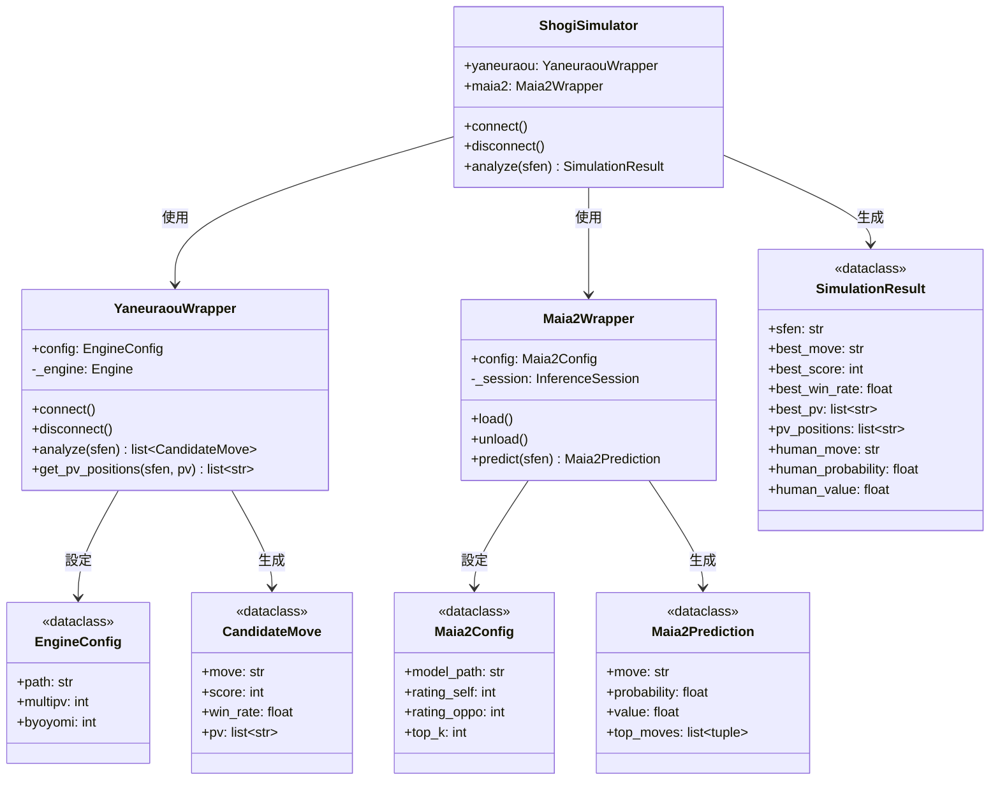

# simulation パッケージ クラス構成

`src/simulation` パッケージは、やねうら王（強いAI）とMaia2（人間レベルAI）を使用した局面分析機能を提供します。

---

## クラス関係図



---

## ファイル構成

```
src/simulation/
├── __init__.py          # パッケージ定義（公開APIをエクスポート）
├── models.py            # データモデル（CandidateMove, SimulationResult）
├── engine_wrapper.py    # やねうら王ラッパー
├── maia2_wrapper.py     # Maia2ラッパー
├── simulator.py         # 統合シミュレーター
└── game_simulator.py    # 形勢明確化シミュレーター
```

---

## クラス詳細

### ShogiSimulator（統合シミュレーター）

**ファイル**: [simulator.py](file:///c:/Users/hashimoto/shogiLLM/src/simulation/simulator.py)

やねうら王とMaia2を統合し、両方の分析結果をまとめて返すメインクラス。

```python
with ShogiSimulator() as sim:
    result = sim.analyze(sfen)
    print(f"最善手: {result.best_move}")
    print(f"人間らしい手: {result.human_move}")
```

| メソッド | 説明 |
|----------|------|
| `connect()` | やねうら王とMaia2に接続 |
| `disconnect()` | 接続を終了 |
| `analyze(sfen)` | 局面を分析し `SimulationResult` を返す |

---

### YaneuraouWrapper（やねうら王ラッパー）

**ファイル**: [engine_wrapper.py](file:///c:/Users/hashimoto/shogiLLM/src/simulation/engine_wrapper.py)

USIプロトコルでやねうら王エンジンと通信し、最善手候補を取得する。

```python
with YaneuraouWrapper(EngineConfig(multipv=3)) as engine:
    candidates = engine.analyze(sfen)
    for c in candidates:
        print(f"{c.move}: 評価値 {c.score}, 勝率 {c.win_rate:.1%}")
```

| メソッド | 説明 |
|----------|------|
| `connect()` | エンジンプロセスを起動し接続 |
| `disconnect()` | エンジンを終了 |
| `analyze(sfen)` | 局面を分析し候補手リストを返す |
| `get_pv_positions(sfen, pv)` | 読み筋を進めた各局面のSFENを返す |

---

### Maia2Wrapper（Maia2ラッパー）

**ファイル**: [maia2_wrapper.py](file:///c:/Users/hashimoto/shogiLLM/src/simulation/maia2_wrapper.py)

ONNXモデルを使用して、指定レーティングの人間が指しそうな手を予測する。

```python
with Maia2Wrapper(Maia2Config(rating_self=1500)) as maia:
    result = maia.predict(sfen)
    print(f"人間らしい手: {result.move} ({result.probability:.1%})")
```

| メソッド | 説明 |
|----------|------|
| `load()` | ONNXモデルをロード |
| `unload()` | モデルをアンロード |
| `predict(sfen)` | 局面を分析し `Maia2Prediction` を返す |

---

### GameSimulator（形勢明確化シミュレーター）

**ファイル**: [game_simulator.py](file:///c:/Users/hashimoto/shogiLLM/src/simulation/game_simulator.py)

対象局面から形勢がはっきりした局面を生成するシミュレーター。
2種類のシミュレーションを実行:

1. **最善応酬（Best Line）**: やねうら王 vs やねうら王
2. **ツリー構築**: Maia2（弱AI）vs やねうら王（強AI）

```python
from src.simulation import GameSimulator, Maia2Config

config = Maia2Config(rating_self=2700)
with GameSimulator(maia2_config=config) as sim:
    result = sim.simulate(sfen)
    print(f"最善応酬: {result.best_line}")
    print(f"ツリーノード数: {len(result.tree.children)}")
```

| メソッド | 説明 |
|----------|------|
| `connect()` | AIに接続 |
| `disconnect()` | 接続を終了 |
| `simulate(sfen)` | シミュレーション実行、`SimulationTree` を返す |

---

## データクラス

### EngineConfig

やねうら王の設定。

| 属性 | 型 | デフォルト | 説明 |
|------|-----|----------|------|
| `path` | `str` | (自動検出) | エンジン実行ファイルのパス |
| `multipv` | `int` | `3` | 取得する候補手の数 |
| `byoyomi` | `int` | `1000` | 探索時間（ミリ秒） |

### Maia2Config

Maia2の設定。

| 属性 | 型 | デフォルト | 説明 |
|------|-----|----------|------|
| `model_path` | `str` | (自動検出) | ONNXモデルのパス |
| `rating_self` | `int` | `1500` | 予測対象のレーティング |
| `rating_oppo` | `int\|None` | `None` | 対戦相手のレーティング（省略時は自分と同じ） |
| `top_k` | `int` | `5` | 取得する候補手の数 |

### CandidateMove

やねうら王が返す候補手。

| 属性 | 型 | 説明 |
|------|-----|------|
| `move` | `str` | USI形式の手（例: `"7g7f"`） |
| `score` | `int` | 評価値（centipawn） |
| `win_rate` | `float` | 勝率（0.0〜1.0） |
| `pv` | `list[str]` | 読み筋のリスト |

### Maia2Prediction

Maia2が返す予測結果。

| 属性 | 型 | 説明 |
|------|-----|------|
| `move` | `str` | 最も確率が高い手（USI形式） |
| `probability` | `float` | その手を指す確率 |
| `value` | `float` | 局面の勝率予測 |
| `top_moves` | `list[tuple[str, float]]` | 上位k個の候補手と確率 |

### SimulationResult

統合シミュレーション結果。

| 属性 | 型 | 説明 |
|------|-----|------|
| `sfen` | `str` | 分析対象の局面 |
| `best_move` | `str` | やねうら王の最善手 |
| `best_score` | `int` | 評価値（centipawn） |
| `best_win_rate` | `float` | 勝率 |
| `best_pv` | `list[str]` | 読み筋 |
| `pv_positions` | `list[str]` | 読み筋の各局面SFEN |
| `human_move` | `str` | Maia2が予測した人間らしい手 |
| `human_probability` | `float` | その手を指す確率 |
| `human_value` | `float` | Maia2が予測した勝率 |

---

## ユーティリティ関数

### `score_to_win_rate(score: int) -> float`

**ファイル**: [models.py](file:///c:/Users/hashimoto/shogiLLM/src/simulation/models.py)

やねうら王の評価値（centipawn）を勝率に変換する。

```python
>>> score_to_win_rate(0)
0.5  # 互角

>>> score_to_win_rate(600)
0.73  # やや有利

>>> score_to_win_rate(-600)
0.27  # やや不利
```

計算式: `win_rate = 1 / (1 + exp(-score / 600))`

（Ponanza定数600を使用したシグモイド関数）
