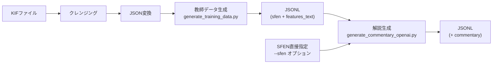

# 解説文生成ガイド

将棋局面から解説文を生成するためのコマンド使用方法。

---

## クイックスタート

### 単一局面の解説を生成（簡単）

```bash
python -m src.training.generate_commentary_openai --sfen "lnsgkgsnl/1r5b1/ppppppppp/9/9/9/PPPPPPPPP/1B5R1/LNSGKGSNL b - 1"
```

→ 標準出力に解説文が表示されます。

### シミュレーション付きで生成

```bash
python -m src.training.generate_commentary_openai \
    --sfen "lnsgkgsnl/1r5b1/ppppppppp/9/9/9/PPPPPPPPP/1B5R1/LNSGKGSNL b - 1"
```

シミュレーションを省略したい場合は `--no-simulation` を追加。

---

## 2つのモード

| モード | 用途 | 引数 |
|--------|------|------|
| **シングルモード** | 1局面だけ解説 | `--sfen "SFEN文字列"` |
| **バッチモード** | 大量の局面を処理 | `--input file.jsonl --output out.jsonl` |

---

## シングルモード（`--sfen`）

1局面だけ解説したい場合に使用。

```bash
# 基本
python -m src.training.generate_commentary_openai --sfen "<SFEN>"

# 特徴テキストを保存
python -m src.training.generate_commentary_openai --sfen "<SFEN>" --save-features features.txt

# プロンプト全文も保存
python -m src.training.generate_commentary_openai --sfen "<SFEN>" --save-prompt prompt.txt

# シミュレーション省略
python -m src.training.generate_commentary_openai --sfen "<SFEN>" --no-simulation
```

---

## バッチモード（`--input`/`--output`）

大量の局面を一括処理する場合に使用。

### Step 1: 教師データを生成

まずSFEN+コメントのペアを含むJSONLを生成：

```bash
python -m src.training.generate_training_data --output data/training/data.jsonl
```

入力: `data/kif_commentary_json/` 内のJSONファイル

### Step 2: 解説文を生成

```bash
python -m src.training.generate_commentary_openai \
    --input data/training/data.jsonl \
    --output data/training/data_generated.jsonl \
    --min-chars 100 --max-chars 220
```

---

## 主要オプション

### 共通

| オプション | 説明 | デフォルト |
|-----------|------|----------|
| `--min-chars N` | 解説文の目安最小文字数 | 50 |
| `--max-chars N` | 解説文の目安最大文字数 | 200 |
| `--model NAME` | OpenAIモデル | gpt-5.2 |
| `--temperature N` | 生成温度 | 0.7 |

### バッチモード専用

| オプション | 説明 |
|-----------|------|
| `--resume` | 中断から再開（既存行をスキップ） |
| `--limit N` | 処理件数を制限 |
| `--skip-if-has-commentary` | 既にcommentaryがある行はスキップ |

---

## 環境設定

OpenAI APIキーと設定を`.env`ファイルに記述：

```
OPENAI_API_KEY=sk-xxxx
OPENAI_MODEL=gpt-4.1-mini   # デフォルトモデルを変更する場合
```

### デフォルトモデルの変更方法

| 方法 | 説明 |
|------|------|
| **環境変数** | `.env` に `OPENAI_MODEL=gpt-4o` を追加 |
| **コマンド引数** | `--model gpt-4o` を指定 |

```bash
# 例: GPT-4oを使用
python -m src.training.generate_commentary_openai --sfen "..." --model gpt-4o
```

**ソースコードの該当箇所**: [generate_commentary_openai.py:625](file:///c:/Users/hashimoto/shogiLLM/src/training/generate_commentary_openai.py#L625)

---

## パイプライン全体像



---

## 関連テストファイル

| テスト対象 | テストファイル |
|-----------|---------------|
| コメントクレンジング | [test_cleanse_kif_commentary.py](file:///c:/Users/hashimoto/shogiLLM/tests/test_cleanse_kif_commentary.py) |
| 特徴量抽出 | [test_features.py](file:///c:/Users/hashimoto/shogiLLM/tests/test_features.py) |
| 特徴量出力 | [test_feature_output.py](file:///c:/Users/hashimoto/shogiLLM/tests/test_feature_output.py) |

> [!NOTE]
> `generate_commentary_openai.py` 自体のテストは現在ありません（OpenAI APIを使用するため）。
