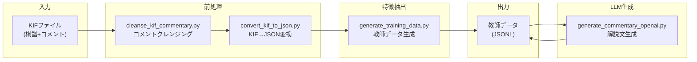

# training パッケージ スクリプト構成

`src/training` パッケージは、LLM学習用の教師データ生成スクリプト群を提供します。

---

## パイプライン概要



---

## スクリプト一覧

| スクリプト | 説明 |
|-----------|------|
| `generate_training_data.py` | 局面特徴＋コメント → 教師データJSONL |
| `generate_commentary_openai.py` | OpenAI APIで解説文を生成 |
| `convert_kif_to_json.py` | KIF形式 → JSON形式変換 |
| `cleanse_kif_commentary.py` | KIFコメントのクレンジング |
| `output_simulation_tree.py` | シミュレーション結果出力 |
| `analyze_comments.py` | コメント分析 |

---

## スクリプト詳細

### generate_training_data.py

**ファイル**: [generate_training_data.py](file:///c:/Users/hashimoto/shogiLLM/src/training/generate_training_data.py)

KIF由来のコメントと局面特徴を組み合わせて教師データを生成。

```bash
# 10件のみ処理（テスト用）
python -m src.training.generate_training_data --limit 10

# 全件処理
python -m src.training.generate_training_data

# シミュレーション付き
python -m src.training.generate_training_data --use-simulation
```

| オプション | 説明 |
|-----------|------|
| `--limit N` | 処理件数を制限 |
| `--use-simulation` | 形勢明確化シミュレーションを実行 |
| `--static-only` | 静的特徴のみ抽出 |
| `--maia-rating N` | Maia2のレーティング指定 |

---

### generate_commentary_openai.py

**ファイル**: [generate_commentary_openai.py](file:///c:/Users/hashimoto/shogiLLM/src/training/generate_commentary_openai.py)

OpenAI APIを使用して局面特徴から解説文を生成。

```bash
python -m src.training.generate_commentary_openai \
    --input data/training/part1.jsonl \
    --output data/training/part1_generated.jsonl \
    --min-chars 100 --max-chars 220
```

| オプション | 説明 |
|-----------|------|
| `--input` | 入力JSONL |
| `--output` | 出力JSONL |
| `--min-chars` | 最小文字数 |
| `--max-chars` | 最大文字数 |
| `--resume` | 中断から再開 |
| `--use-rag` | RAG検索を有効化 |

---

### convert_kif_to_json.py

**ファイル**: [convert_kif_to_json.py](file:///c:/Users/hashimoto/shogiLLM/src/training/convert_kif_to_json.py)

クレンジング済みKIFファイルをJSON形式に変換。

入力: `data/kif_commentary_cleaned/`
出力: `data/kif_commentary_json/`

---

### cleanse_kif_commentary.py

**ファイル**: [cleanse_kif_commentary.py](file:///c:/Users/hashimoto/shogiLLM/src/training/cleanse_kif_commentary.py)

KIFファイルのコメントから不要な情報（時間、対局場所など）を除去。

| 関数 | 説明 |
|------|------|
| `is_move_line(line)` | 棋譜行かどうか判定 |
| `remove_sentences_with_keyword(line, keyword)` | キーワードを含む文を削除 |
| `contains_keyword(line, keywords)` | キーワード判定 |

---

### output_simulation_tree.py

**ファイル**: [output_simulation_tree.py](file:///c:/Users/hashimoto/shogiLLM/src/training/output_simulation_tree.py)

シミュレーション結果をBOD形式、KI2U形式で出力。
